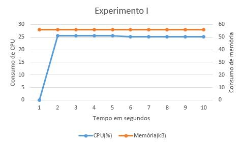
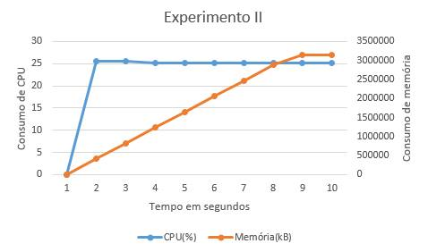

# Identificação

* Página do repositório do trabalho ([link GitHub](https://github.com/Leandro97/teaching)) 

* Discente 1
	* Nome: Leandro Martins de Freitas
	* Matrícula: 15111982 
* Discente 2
	* Nome: Douglas Henrique Maximo da Silva
	* Matrícula: 15111881

# Discussão 

* TODO: Em cada seção:
	* explicar e discutir sobre o comportamento do programa para cada experimento;
	* sempre referenciar o código fonte e o gráfico do experimento realizado;
	* colocar um gráfico do consumo da UCP e da memória pelo processo filho em função do tempo sendo duas curvas;
		* cada curva representa uma métrica medida (consumo de CUP em porcentagem e consumo de memória em Kilobytes);
		* o eixo das abscissas deve representar o tempo medido a cada segundo e o eixo das coordenadas deve ser a métrica medida.

##Utilização intensa da UCP 

No experimento em questão, foi notado que na marca de 1 segundo, a utilização de CPU é de 0.0%, isso se dá pelo fato de que, quando o algoritmo é executado pelo usuário, o seu processo é mandado, inicialmente, para a fila de espera para apenas em seguida ir para a execução no processador. 

A partir do tempo 2 até o tempo 10, o experimento tem como saída, em média, 25.3% de uso de CPU, para um computador com 4 núcleos - como o utilizado no experimento -, isso evidencia que, durante o tempo de execução, numa máquina com apenas um núcleo, este se dedicaria inteiramente à execução do processo.

Nota-se também que a quantidade de memória mantem-se constante, pois apenas a quantidade de memória suficiente à execução do programa foi alocada. Vide figura Gráfico do Experimento I.

## Utilização intensa da UCP e memória
	

No experimento II, quanto ao uso de UCP, é idêntico ao Experimento I, tendo no tempo 1, 0.0% de uso e a partir do tempo 2 até o tempo 10, mantem-se em média com 25.3% de uso. 
Já em relação ao uso de memória, nota-se que, diferentemente do Experimento I, o experimento II, aloca memória em cada tempo, tendo um grande crescimento a partir do tempo 1 até o tempo 8, e do tempo 8 ao 10, o crescimento no uso de memória diminui e tende a se estabilizar, vide figura Gráfico do Experimento II. A explicação para tal fato é que o alocamento de memória está se aproximando do máximo da capacidade da máquina, com isso, o sistema operacional bloqueia a quantidade máxima de memória a ser utilizada por aquele processo, por isso o crescimento do alocamento de memória tende a zerar.

